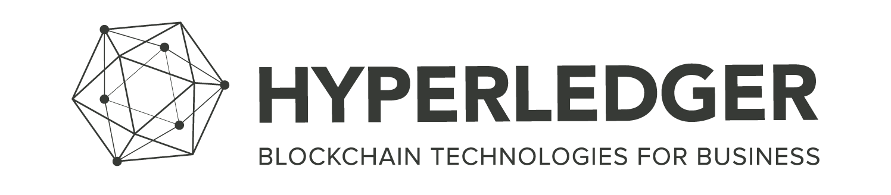

# Use Open Liberty and Develop a Blockchain Client

The end goal is to have an application server called Open Liberty serving up transactions available in your blockchain smart contract, that you will create with the use of two Open source IBM Projects **IBM Blockchain Platform IBP** and **Open Liberty**.

By the end of the tutorial you will be able to: Start up a blockchain network through the VS Code extension, Enroll users onto a Blockchain Network, this means you can add `Organisations`. We will be using a one org network. Add Cars to a Blockchain ledger, Query all cars to see what is on the network, and also query specific cars from the ledger.

### Prerequisites:

* Java
* Git
* Maven

### Get the Dev Tools:

* [Open Liberty Extension](https://marketplace.visualstudio.com/items?itemName=Open-Liberty.liberty-dev-vscode-ext) 
* [Blockchain VS Code Extension](https://marketplace.visualstudio.com/items?itemName=IBMBlockchain.ibm-blockchain-platform)

## 1. Configuration for IBP 

A. Open up VS Code and install IBM Blockchain Platform VS Code extension (IBP) [Blockchain VS Code Extension](https://marketplace.visualstudio.com/items?itemName=IBMBlockchain.ibm-blockchain-platform) and ensure all the pre-reqs are set up. 

_After installation, if you need any additional pre-reqs, the extension will guide you through installing them. Make sure you pick up the Docker pre-reqs, as they'll be used to create your Fabric network.  Make sure you pick up the Docker pre-reqs, as they'll be used to create your Fabric network_

B. Click the VS Code extension in the top right corner

C. Pick the FabCar sample from the Example code section

D. Once it is cloned you can pick which ever language, choose Java as Open Liberty is a Java application server.

## 2. Add a Fabric Environment and Setup network

A. Go to the "IBM Blockchain Platform" view in VS Code by clicking the IBP icon on the IDE Navigation bar on the left hand side

B. Hover over the "Fabric Environments" section title and click the `+` icon

C. Choose `Add a new local network (from template)`

D. Choose the 1 Org template

E. Wait for the network to spin up. 

* This will download the Docker images required for a local Fabric setup, and start the network. 

## 3. Deploy the FabCar Smart Contract

Click on `+Install` under Installed dropdown in the `Fabric Environments` console. Choose the `fabcar@1.0.0` contract. You should see a notification for successful install of the smart contract, and the smart contract listed under Installed in your `Fabric Environments` console. You are now ready to `instantiate` the smart contract.

Click on `+Instantiate` under Instantiated dropdown in the `Fabric Environments` console. Choose the channel: mychannel. Choose the `fabcar@1.0.0 contract`. 

In the Command pallete type in `initLedger` for the function. You can press `Enter` for optional arguments. Once this is successfully instantiated, you should see a successful notification in the output view, and the smart contract listed under `Instantiated` in your `Fabric Environments` console.


## 4. Start interacting with the Blockchain Network from Open Liberty

### Load the Open Liberty project into VS Code

In the `Explorer` tab in the VS code extension load the Open Liberty Project.

Start up the Open Liberty Server. Click on the `Liberty Dev Dashboard` and the project to start the Application server will be there. To start the server, right click the project, `start`. This will start the server in `Development Mode`, you can run tests on the server and also see the output. 

## 5. Test that the server is running:

Open up a browser of your choice and hit the RESTful endpoint of `Hello world` which will return `Hello World`. This is a basic test to see if it is working. Hit the end point: `http://localhost:9080/LibertyProject/System/helloworld`

## 6. Query what is already on the ledger:

As we are using a pre loaded blockchain network cars are already on the network and you can view them by hitting the `QueryCar/AllCars` endpoint: `http://localhost:9080/LibertyProject/System/QueryCar/AllCars`

Check the terminal that Open Liberty started and it will show the returned cars and it will also display on the Web Browser:

```json
Queried all Cars Successfully.
Cars:
[{"Key":"CAR0","Record":{"make":"Toyota","model":"Prius","colour":"blue","owner":"Tomoko"}},{"Key":"CAR1","Record":{"make":"Ford","model":"Mustang","colour":"red","owner":"Brad"}},{"Key":"CAR10","Record":{"make":"VW","model":"Polo","colour":"Grey","owner":"Mary"}},{"Key":"CAR11","Record":{"make":"VW","model":"Polo","colour":"P!ink","owner":"Mary"}},{"Key":"CAR2","Record":{"make":"Hyundai","model":"Tucson","colour":"green","owner":"Jin Soo"}},{"Key":"CAR3","Record":{"make":"Volkswagen","model":"Passat","colour":"yellow","owner":"Max"}},{"Key":"CAR4","Record":{"make":"Tesla","model":"S","colour":"black","owner":"Adriana"}},{"Key":"CAR5","Record":{"make":"Peugeot","model":"205","colour":"purple","owner":"Michel"}},{"Key":"CAR6","Record":{"make":"Chery","model":"S22L","colour":"white","owner":"Aarav"}},{"Key":"CAR7","Record":{"make":"Fiat","model":"Punto","colour":"violet","owner":"Pari"}},{"Key":"CAR8","Record":{"make":"Tata","model":"Nano","colour":"indigo","owner":"Valeria"}},{"Key":"CAR9","Record":{"make":"Holden","model":"Barina","colour":"brown","owner":"Shotaro"}}]
```

## 7. Query specific items on the ledger:

There is added functionality to Query specific cars on the ledger. Once all the cars are displayed on the ledger you can query by `CarByKeyID`. For example query `CAR5` and see the details of it: `http://localhost:9080/LibertyProject/System/QueryCar/CarByKeyID?Key=CAR5`

```json
Queried car Successfully. 
Key = CAR5
Details = {"make":"Peugeot","model":"205","colour":"purple","owner":"Michel"}
```

Query any car on the ledger by replacing the <ID> with an ID:
  `http://localhost:9080/LibertyProject/System/QueryCar/CarByKeyID?Key=<ID>`


## 8. Add a car to the ledger:

Open up a new terminal window in VS Code by clicking the window button and it will split into two terminals and create a `POST` request to add to the ledger:

`curl -X POST "http://localhost:9080/LibertyProject/System/AddCar?make=Volkswagon&model=Golf&colour=white&owner=Tom"`

## Well Done

Congratulations you have completed the task of using two IBM Products concurrently, as well as experiencing how easy it is to create a Blockchain Network and the concpets of Blockchain.

 


